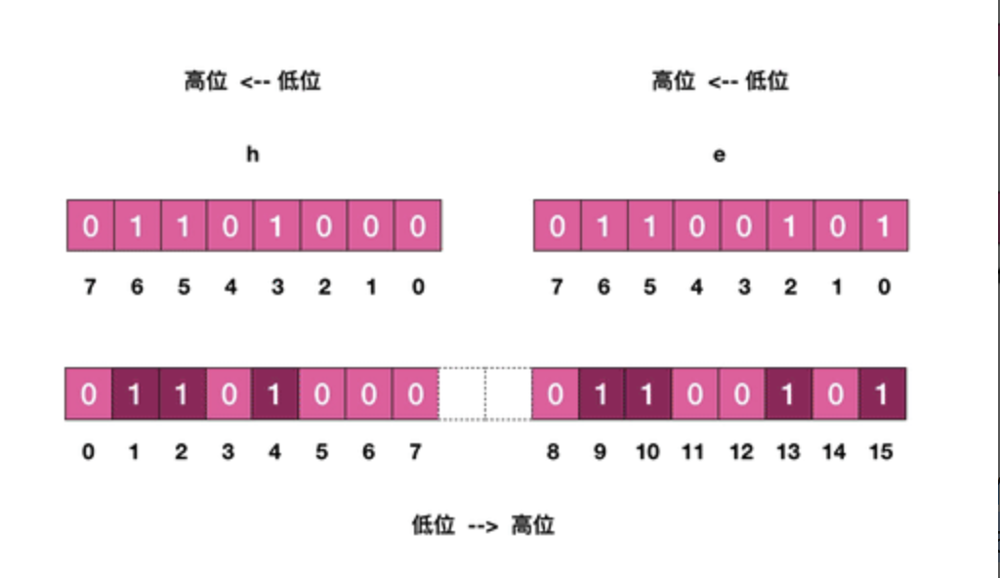

## Bitmap （位图）

**思考：比如需要记录用户一年的签到记录，签了是 1，没签是 0，要记录 365 天。**

为了解决这个问题，Redis 提供了位图数据结构，这样每天的签到记录只占据一个位，

365 天就是 365 个位，46 个字节 (一个稍长一点的字符串) 就可以完全容纳下，这就大大节约了存储空间。

位图不是特殊的数据结构，它的内容其实就是普通的字符串，也就是 byte 数组。

我们可以使用普通的 get/set 直接获取和设置整个位图的内容，也可以使用位图操作 getbit/setbit 等将 byte 数组看成「位数组」来处理。

### 基本使用

Redis 的位数组是自动扩展，如果设置了某个偏移位置超出了现有的内容范围，就会自动将位数组进行零扩充。

接下来我们使用位操作将字符串设置为 hello (不是直接使用 set 指令)，

首先我们需要得到 hello 的 ASCII 码，下面得到每个字符的 ASCII 码的二进制值。


```python
print(bin(ord('h')))
print(bin(ord('e')))
print(bin(ord('l')))
print(bin(ord('l')))
print(bin(ord('o')))
```

    0b1101000
    0b1100101
    0b1101100
    0b1101100
    0b1101111




**h 字符只有 1/2/4 位需要设置，e 字符只有 9/10/13/15 位需要设置。 值得注意的是位数组的顺序和字符的位顺序是相反的。**


```python
!redis-cli setbit he 1 1 
!redis-cli setbit he 2 1 
!redis-cli setbit he 4 1 
!redis-cli setbit he 9 1 
!redis-cli setbit he 10 1 
!redis-cli setbit he 13 1 
!redis-cli setbit he 15 1 
!redis-cli get he 
```

    (integer) 0
    (integer) 0
    (integer) 0
    (integer) 0
    (integer) 0
    (integer) 0
    (integer) 0
    "he"


上面这个例子可以理解为「零存整取」，同样我们还也可以「零存零取」，「整存零取」。

- 「零存」就是使用 setbit 对位值进行逐个设置，

- 「整存」就是使用字符串一次性填充所有位数组，覆盖掉旧值。

### 零存零取


```python
!redis-cli setbit w 1 1
!redis-cli setbit w 3 1
!redis-cli getbit w 1
!redis-cli getbit w 2
!redis-cli getbit w 3
```

    (integer) 0
    (integer) 0
    (integer) 1
    (integer) 0
    (integer) 1


### 整存零取


```python
!redis-cli set w h 
!redis-cli getbit w 1
!redis-cli getbit w 2
!redis-cli getbit w 3
!redis-cli getbit w 4
!redis-cli getbit w 5
```

    OK
    (integer) 1
    (integer) 1
    (integer) 0
    (integer) 1
    (integer) 0


### 统计和查找

Redis 提供了位图统计指令 bitcount 和位图查找指令 bitpos，

bitcount 用来统计指定位置范围内 1 的个数，bitpos 用来查找指定范围内出现的第一个 0 或 1。

比如我们可以通过 bitcount 统计用户一共签到了多少天，通过 bitpos 指令查找用户从哪一天开始第一次签到。

如果指定了范围参数[start, end]，就可以统计在某个时间范围内用户签到了多少天，用户自某天以后的哪天开始签到。

遗憾的是， start 和 end 参数是字节索引，也就是说指定的位范围必须是 8 的倍数，而不能任意指定。


因为这个设计，我们无法直接计算某个月内用户签到了多少天，而必须要将这个月所覆盖的字节内容全部取出来 (getrange 可以取出字符串的子串) 然后在内存里进行统计，这个非常繁琐。

接下来我们简单试用一下 bitcount 指令和 bitpos 指令


```python
!redis-cli set w hello
!redis-cli bitcount w 
!redis-cli bitcount w  0 0
!redis-cli bitcount w  0 2
```

    OK
    (integer) 21
    (integer) 3
    (integer) 11


**BITPOS key bit [start] [end]**

返回字符串里面第一个被设置为1或者0的bit位。


```python
!redis-cli bitpos w  0
!redis-cli bitpos w  1
!redis-cli bitpos w  1 1 1
!redis-cli bitpos w  0 2 2
```

    (integer) 0
    (integer) 1
    (integer) 9
    (integer) 16


### 魔术指令 bitfield    (自行练习)

**BITFIELD key [GET type offset] [SET type offset value] [INCRBY type offset increment] [OVERFLOW WRAP|SAT|FAIL]**


