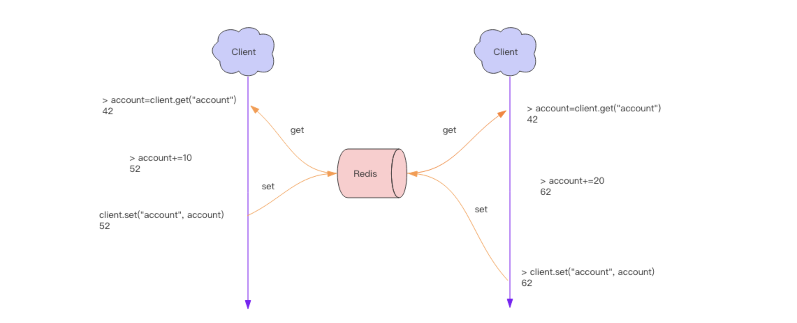

比如一个操作要修改用户的状态，修改状态需要先读出用户的状态，在内存里进行修改，改完了再存回去。如果这样的操作同时进行了，就会出现并发问题，因为读取和保存状态这两个操作不是原子的。

**所谓原子操作是指不会被线程调度机制打断的操作；这种操作一旦开始，就一直运行到结束，中间不会有任何 context switch 线程切换。**



### 分布式锁

分布式锁本质上要实现的目标就是在 Redis 里面占一个“坑”，当别的进程也要来占时，发现已经有人占了，就只好放弃或者稍后再试。

占坑一般是使用 setnx(set if not exists) 指令，只允许被一个客户端占坑。先来先占， 用完了，再调用 del 指令释放。


> setnx lock:code true

> del lock:code


但是有个问题，如果逻辑执行到中间出现异常了，可能会导致 del 指令没有被调用，这样就会陷入死锁，锁永远得不到释放。


> setnx lock:code true
    
> expire lock:code 5

> del lock:code
    
如果在 setnx 和 expire 之间服务器进程突然挂掉了，可能是因为机器掉电或者是被人为杀掉的，就会导致 expire 得不到执行，也会造成死锁。

这种问题的根源就在于 setnx 和 expire 是两条指令而不是原子指令。如果这两条指令可以一起执行就不会出现问题。

### 解决方法

- **Lua脚本**      

 ```lua
    
        local key   = KEYS[1]
        local value = ARGV[1]
        local ttl   = ARGV[2]

        local ok = redis.call('setnx', key, value)
        if ok == 1 then
            redis.call('expire', key, ttl)
        end
        return ok
```

- **set的命令**

SET key value [EX seconds] [PX milliseconds] [NX|XX]


```python
!redis-cli set lock:code true ex 5 nx
```

    OK


### 超时问题

Redis 的分布式锁不能解决超时问题，如果在加锁和释放锁之间的逻辑执行的太长，以至于超出了锁的超时限制，就会出现问题。

因为这时候锁过期了，第二个线程重新持有了这把锁，但是紧接着第一个线程执行完了业务逻辑，就把锁给释放了，

第三个线程就会在第二个线程逻辑执行完之间拿到了锁。


有一个稍微安全一点的方案是为 set 指令的 value 参数设置为一个随机数，

释放锁时先匹配随机数是否一致，然后再删除 key，这是为了确保当前线程占有的锁不会被其它线程释放，除非这个锁是过期了被服务器自动释放的。

但是匹配 value 和删除 key 不是一个原子操作，Redis 也没有提供类似于delifequals这样的指令，

这就需要使用 Lua 脚本来处理了，因为 Lua 脚本可以保证连续多个指令的原子性执行。


```lua

if redis.call("get",KEYS[1]) == ARGV[1] then
    return redis.call("del",KEYS[1])
else
    return 0
end

```

但是这也不是一个完美的方案，它只是相对安全一点，因为如果真的超时了，当前线程的逻辑没有执行完，其它线程也会乘虚而入。


